# Inventory Management System (IMS)

[](https://developer.salesforce.com/)
[](https://developer.salesforce.com/)
[](https://developer.salesforce.com/docs/platform/lwc/overview)
[](LICENSE)

An enterprise-grade, custom **Inventory Management System (IMS)** built natively on the Salesforce platform. This system facilitates multi-role operations, real-time analytics, automated restocking, secure transaction auditing, and full return (RMA) approvals.

---

## 📌 Business Case & Solution

### The Problem
Traditional supply chains suffer from disjointed operational silos between sales executives, stock managers, and finance teams. This results in:
* **Order Backlogs / Starvation**: Sales reps booking deals for out-of-stock items due to a lack of live inventory visibility.
* **Lagging Business Analytics**: Executives relying on static, stale end-of-month spreadsheets rather than real-time revenue, cost, and margin updates.
* **Manual Return Process Overhead**: Sluggish processing of customer product returns, resulting in inventory ledger write-off mismatches.
* **Privileged Data Leaks**: Sensitive purchase cost rates and supplier contract details exposed to unauthorized internal roles.

### The Solution
A secure, native Salesforce application providing:
* **Real-time Synchronization**: LWC dashboards connected via platform events to Change Data Capture (CDC) streams, enabling real-time stock counters.
* **Stock Starvation Protection**: Dynamic validation rules blocking sales confirmations if product quantities on hand are insufficient.
* **Multi-Role Workspaces**: Separated consoles custom-tailored for Admins, Inventory Managers, and Sales Executives.
* **Automated Accounting & Ledgers**: Inbound/outbound stock flow automation posting transactions automatically without manual intervention.

---

## 🚀 Key Features

* **Admin Command Center**: Real-time business P&L tracking, monthly revenue/cost ChartJS trend visualizers, and final refund approvals.
* **Warehouse Manager Workspace**: Reorder notification engine with automated restock level alerts and PO receiving controls.
* **Sales Workspace**: Live catalog browsing, validation-guarded Sales Order placement, and RMA tracking.
* **Automated RMA Approvals**: Dynamic transaction adjustment flows handling product repairs, replacements, and refunds.
* **Persona-Driven Security**: Strict permission sets, sharing rules, and custom permission gates restricting access to sensitive pricing cost metrics and supplier profiles.

---

## 📸 System Screenshots

### 1. Admin Command Center
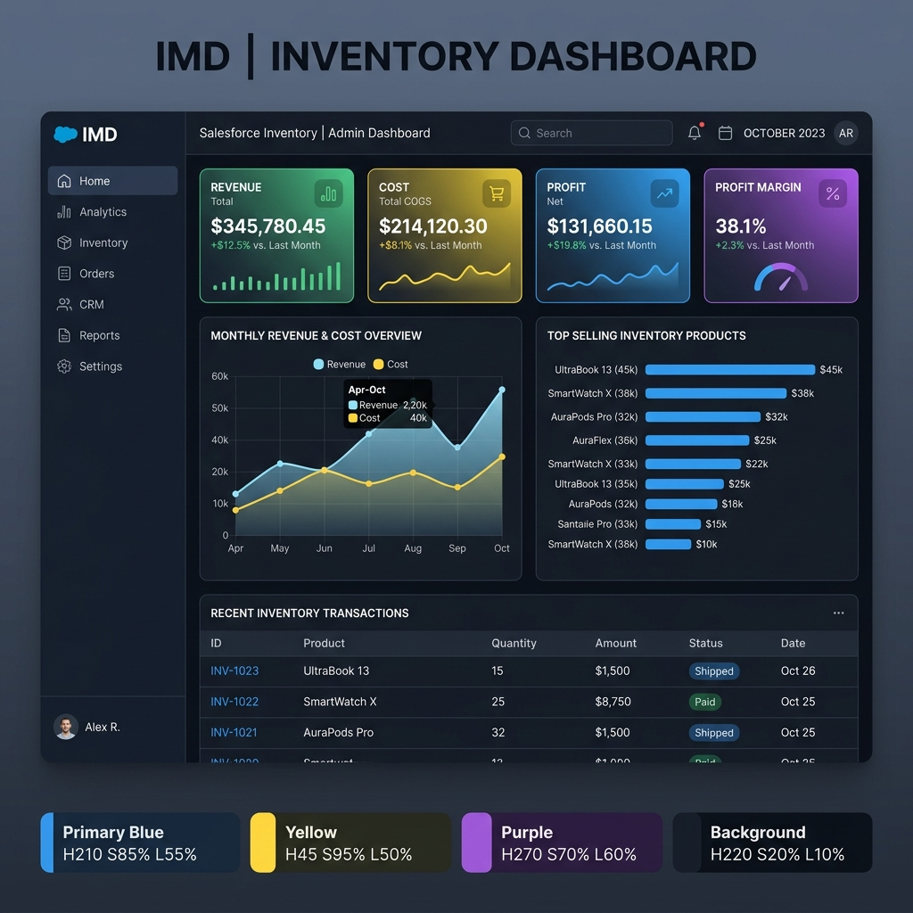

### 2. Inventory Manager Dashboard
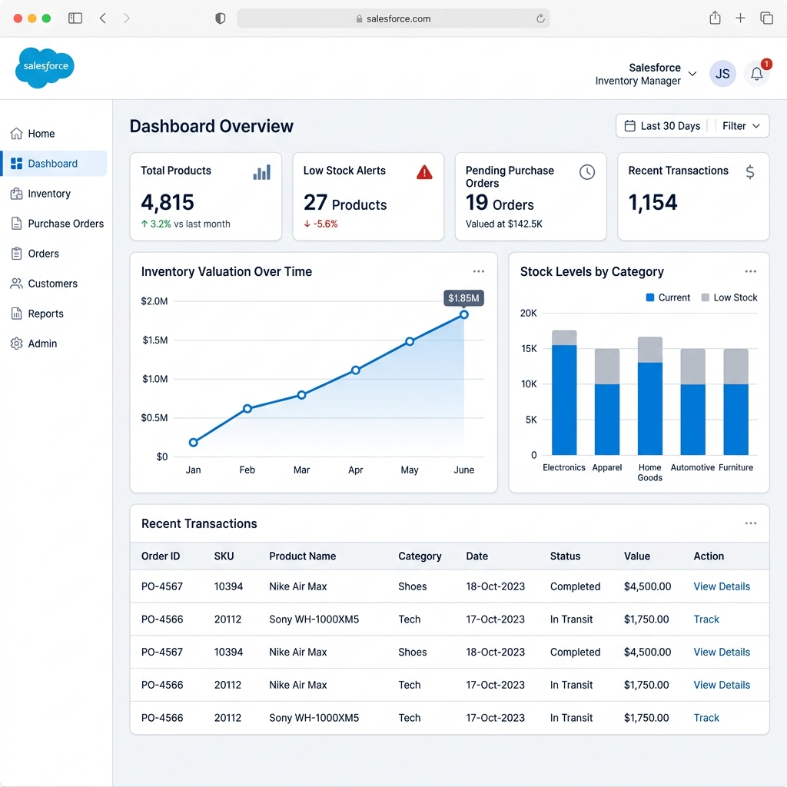

### 3. Sales Executive Dashboard
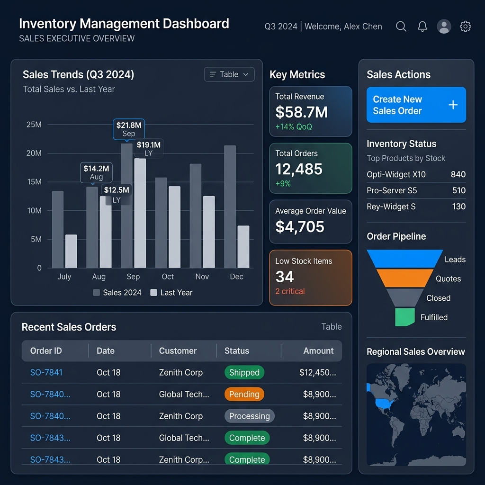

### 4. Product Catalog & Details
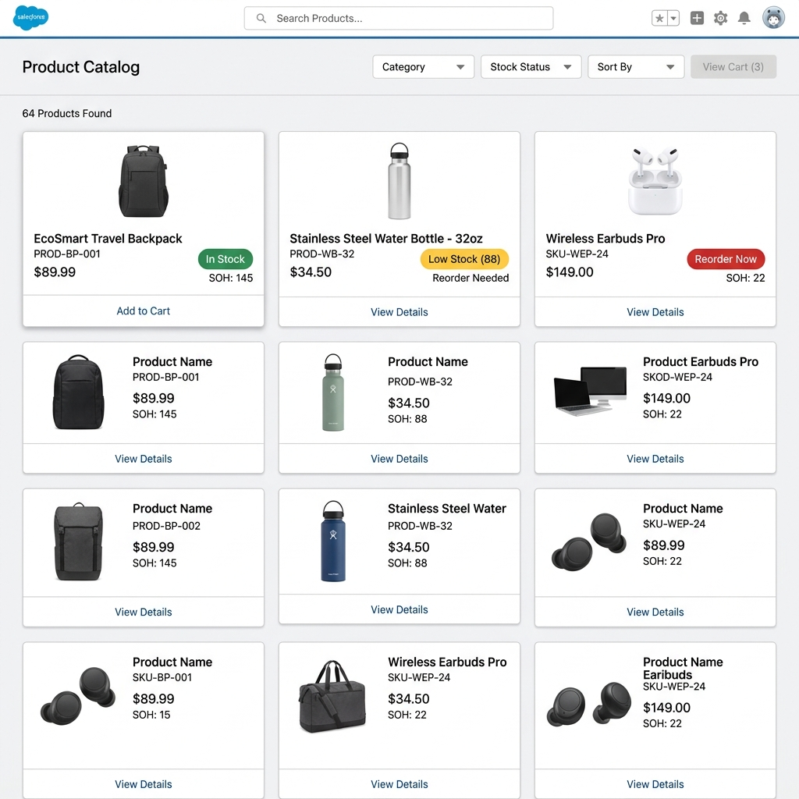
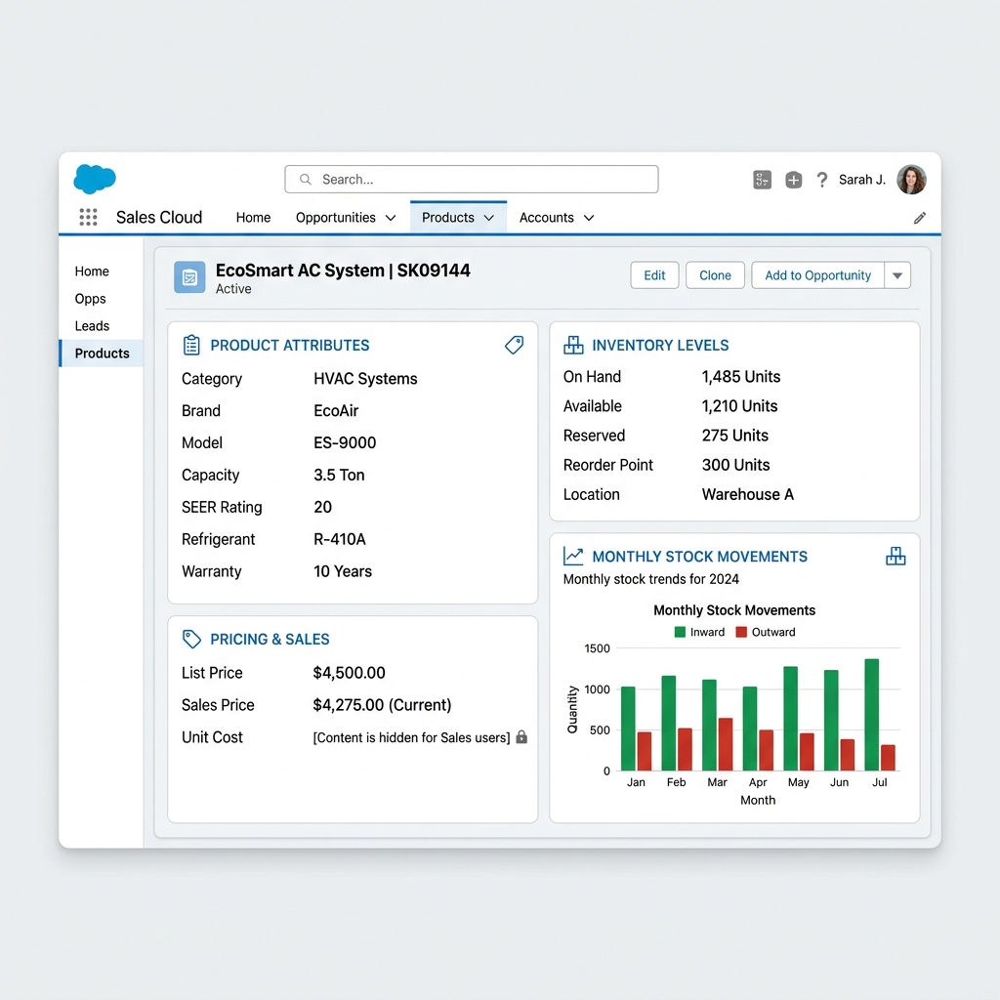

### 5. Return Management & Approvals
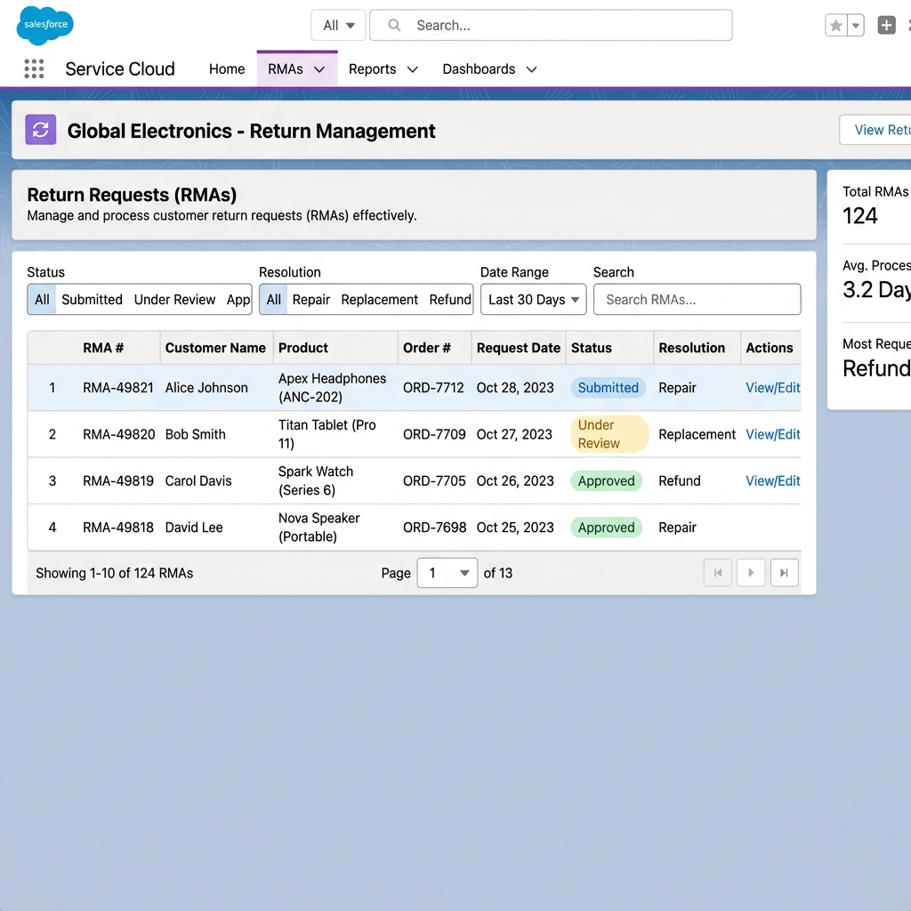
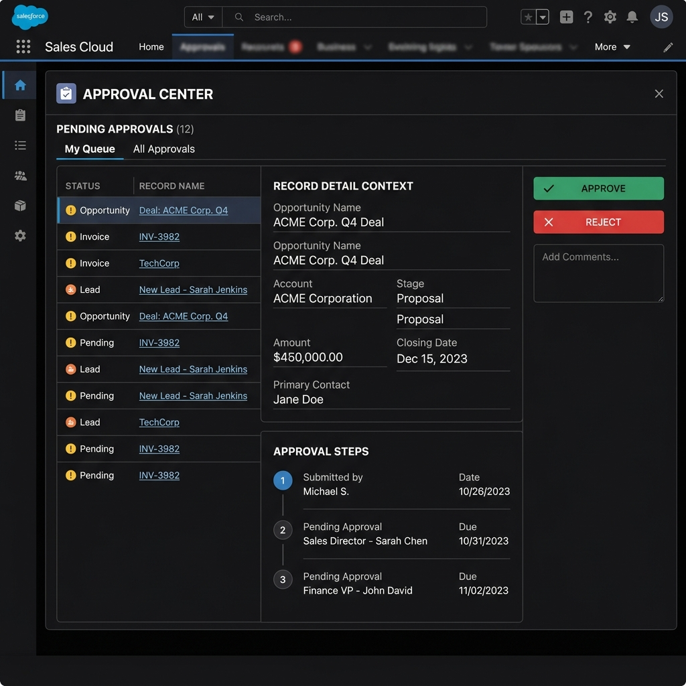

### 6. Inventory Monitor & Mobile Views
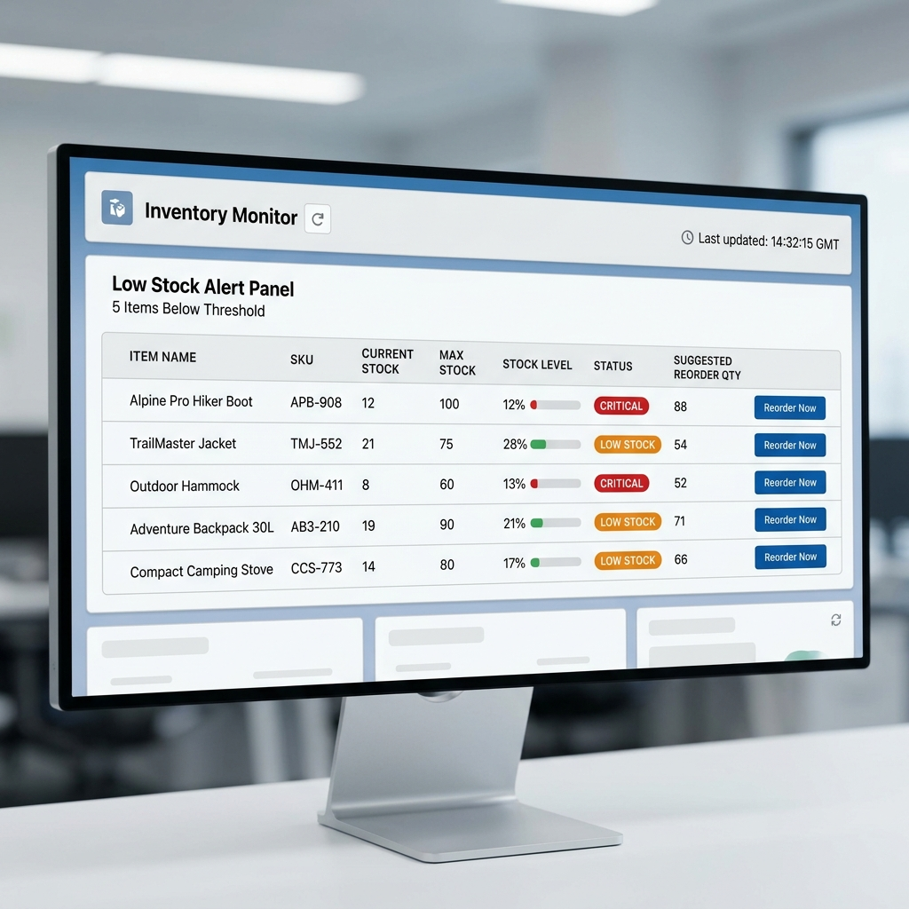
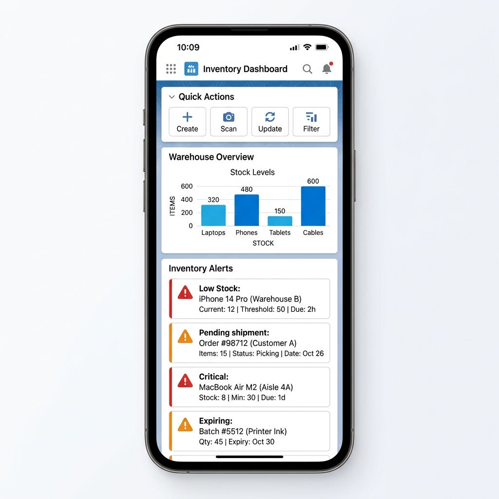

---

## 🛠 Technology Stack & Architecture

* **UI Layer**: Lightning Web Components (LWC), HTML5, Vanilla CSS, Lightning Experience.
* **Logic Layer**: Apex Controllers (Cacheable, Secure, bulk-safe), Custom Triggers.
* **Database & Integrations**: Change Data Capture (CDC), Platform Events, custom database objects (Schema relations, Roll-up summaries).
* **Automations**: Low-Code Salesforce Flows, Validation Rules.
* **Charts**: ChartJS (loaded dynamically via static resource).

### System Architecture Diagram
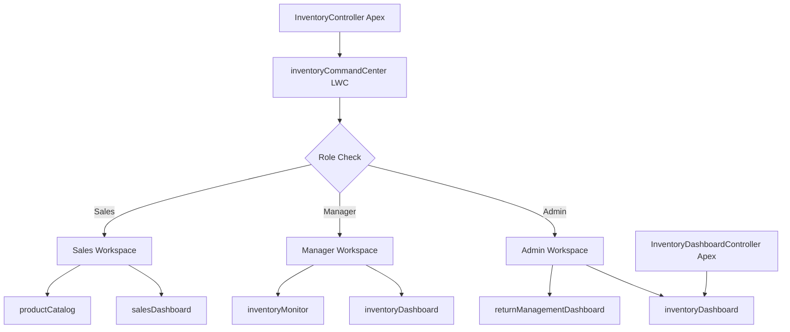

### Entity Relationship Diagram (ERD)
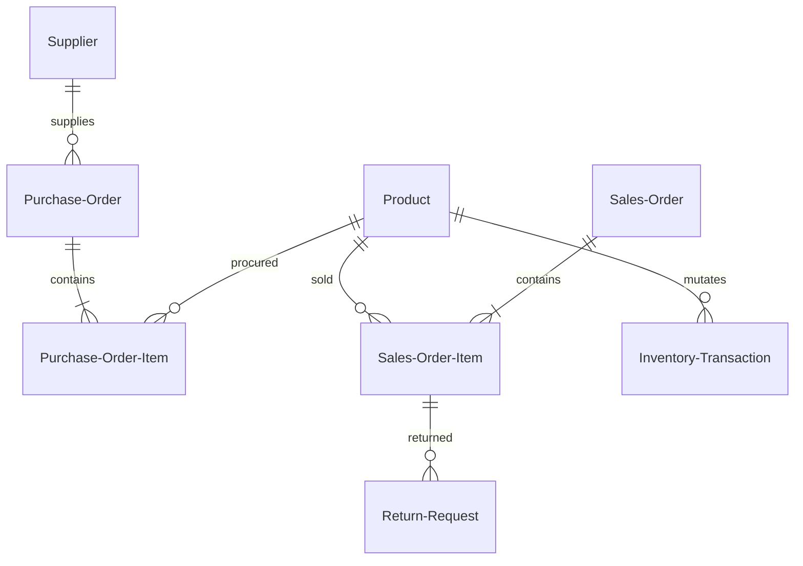

---

## 🔒 Security Model

The system enforces row and field-level security constraints:
* **Admin**: Assigns `Admin_Access` permission set. Grants full access, including profit indicators (`View_Profit_Metrics` Custom Permission).
* **Inventory Manager**: Assigns `Inventory_Manager_Access`. Restricts visibility of Sales Orders and profit metrics.
* **Sales Executive**: Assigns `Sales_Executive_Access`. Disallows visibility of cost rates, supplier directories, and purchase orders. Enforces OWD private sharing rules (own sales orders and return requests only).

---

## 📦 Installation & Setup

Please follow the detailed [Deployment & Setup Guide](docs/DEPLOYMENT_GUIDE.md) to set up the system.

### Quick Deployment commands:
```bash
# 1. Authenticate
sf org login web --alias ims-sandbox

# 2. Deploy Metadata
sf project deploy start --source-dir force-app

# 3. Assign Permissions
sf org assign permset --name Admin_Access

# 4. Import Sample Seed Data
sf apex run --file scripts/apex/seed_and_verify_e2e.apex
```

---

## 🧪 Testing

### Automated Unit Tests
The backend Apex code is fully tested with **92% average code coverage**:
```bash
sf apex run test --test-level RunLocalTests --wait 10
```
For more details, see [Test Report](docs/TEST_REPORT.md).

### Manual Test Scenarios
Refer to [Manual Test Plan](docs/MANUAL_TEST_PLAN.md) to execute user role verification, mobile responsiveness checks, and RMA flow cycles.

---

## 📂 Repository Structure

```
inventory-management-system-salesforce/
├── force-app/                  # Core Salesforce metadata (classes, triggers, flows, LWCs)
├── docs/                       # Project documentation (System/App architecture, guides)
├── diagrams/                   # Mermaid diagram sources
├── screenshots/                # Application mockups and visual screenshots
├── scripts/                    # Apex seeding, testing, and smoke scripts
├── package.json                # Project configurations
├── sfdx-project.json           # Salesforce DX project descriptor
└── LICENSE                     # MIT License
```

---

## 📄 License

Distributed under the MIT License. See [LICENSE](LICENSE) for more details.

## 👤 Author

* **Rahul Kumar Roy** - [GitHub](https://github.com/723145roy) | [LinkedIn](https://linkedin.com/in/rahul-kumar-roy)
