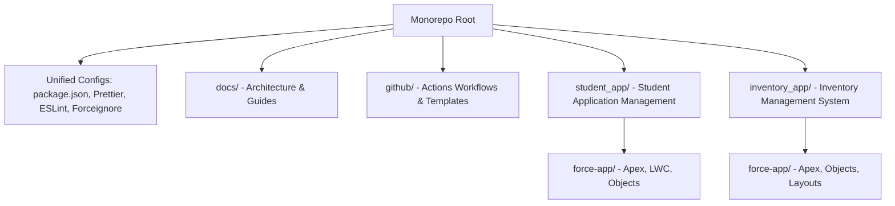

# Salesforce Enterprise Monorepo

Welcome to the **Salesforce Enterprise Monorepo**. This repository contains two independent custom applications built with Salesforce DX:

1. **Student Application Management System (SAMS)**: Manages student admissions, documents, payments, and notifications.
2. **Inventory Management System**: Manages product records, suppliers, sales orders, purchase orders, and inventory transactions.

This project is built using modern Salesforce practices including the Lightning Web Component (LWC) framework, Apex design patterns, flows, sharing rules, and automated CI/CD configurations.

---

## 🏛️ Repository Architecture

This repository is structured as a **Salesforce DX Monorepo**. Both applications share a single root configuration (`sfdx-project.json`), configuration tooling (`package.json`, `.prettierrc`, `eslint.config.js`), and GitHub Actions pipeline, while keeping metadata and application source directories isolated.



---

## 📱 Application Modules & Features

### 🎓 1. Student Application Management System (SAMS)
SAMS is designed to streamline the student enrollment pipeline:
- **Course Cataloging**: Tracks active courses, credits, capacities, fees, and seating in real-time.
- **Student Admissions**: Automates approved applications into institutional admissions, generating PDF certificates via Visualforce.
- **Document Verification**: Multi-file document upload, review, and status logging.
- **Payment Processing**: Integrates course fee extraction, automated receipts, and transaction status syncing.
- **Interactive Dashboards**: SPAs for students (course wizard, timeline tracker) and admins (KPI panels, transaction history).

### 📦 2. Inventory Management System
A back-office application to manage warehouse inventory and procurement:
- **Product Tracking**: Logs SKUs, cost prices, selling prices, and real-time stock levels.
- **Suppliers**: Links inventory items to registered product suppliers.
- **Procurement & Sales**: Logs customer sales orders and purchases.
- **Inventory Ledger**: Tracks inflow, outflow, and warehouse stock adjustments.

---

## 🛠️ Technology Stack

- **Platform**: Salesforce Custom Objects, Sharing Rules, Approval Processes
- **Backend**: Salesforce Apex (Triggers, Controllers, without sharing helpers)
- **Frontend**: Lightning Web Components (LWC), Visualforce (PDF generation), CSS (Navy & Gold Theme)
- **Tooling**: Salesforce CLI, ESLint, Prettier, Husky, LWC Jest
- **CI/CD**: GitHub Actions

---

## 🚀 Installation & Setup

### Prerequisites
1. Install [Salesforce CLI](https://developer.salesforce.com/tools/sfdxcli) or the newer `sf` CLI.
2. Install [Node.js](https://nodejs.org/) (v18 or higher recommended).
3. Sign up for a [Salesforce Developer Edition Org](https://developer.salesforce.com/signup) or use a Dev Hub.

### Step 1: Clone the Repository
```bash
git clone https://github.com/panda601/student_app.git
cd student_app
```

### Step 2: Install Development Dependencies
```bash
npm install
```

### Step 3: Authenticate with your Salesforce Org
```bash
sf org login web -d -a DevOrg
```

### Step 4: Deploy the Metadata to your Org
You can deploy either application individually or the entire monorepo.

To deploy **SAMS**:
```bash
sf project deploy start --package-dir student_app/force-app
```

To deploy **Inventory System**:
```bash
sf project deploy start --package-dir inventory_app/force-app
```

To deploy **everything**:
```bash
sf project deploy start
```

### Step 5: Assign Permission Sets
Assign access rights to target users:
```bash
sf org assign permset --name Student_Portal_Access -o DevOrg
```

---

## 📋 Environment Variables
A `.env.example` file is included at the root directory. Copy it to `.env` and configure your credentials for scripts or API testing:
```bash
SF_USERNAME=your-salesforce-username
SF_CLIENT_ID=your-connected-app-client-id
SF_JWT_KEY_FILE=path/to/server.key
```

---

## 🛡️ Security & Access Control

Both applications enforce security-first design principles:
- **Organization-Wide Defaults (OWD)**: Configured as `Private` for applications, admissions, and payments.
- **Apex Security**: Every query uses `WITH USER_MODE` or `WITH SYSTEM_MODE` explicitly to preserve field-level security.
- **Sharing Rules**: Criteria-based sharing rules give access dynamically to role-specific employees.

---

## 🤝 Contributing

We welcome contributions! Please review our:
- [CONTRIBUTING.md](file:///d:/SF%20Project/CONTRIBUTING.md) for code submission guidelines and branching strategy.
- [CODE_OF_CONDUCT.md](file:///d:/SF%20Project/CODE_OF_CONDUCT.md) for community standards.
- [SECURITY.md](file:///d:/SF%20Project/SECURITY.md) to report security issues.

---

## 📄 License
This project is licensed under the MIT License. See [LICENSE](file:///d:/SF%20Project/LICENSE) for details.
