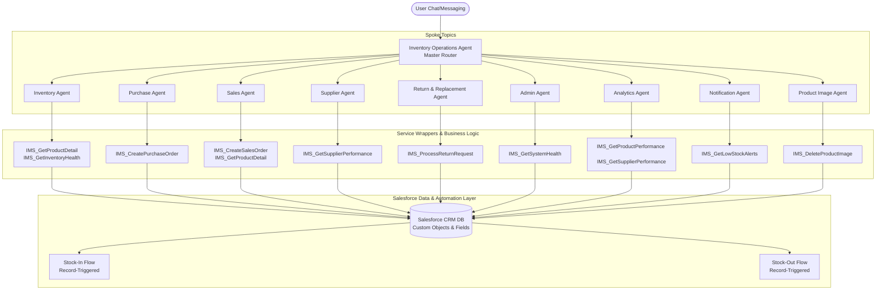

# Agent Architecture - Inventory Operations Agent

This document details the multi-agent system architecture designed for the Inventory Management System (IMS). The architecture follows a central Orchestrator (Hub) and specialized Topics (Spokes) pattern, implemented on the Salesforce Agentforce (Service Agent) platform.

## High-Level Architecture Diagram

## Architecture Principles

### 1. Hub-and-Spoke Pattern
The **Inventory Operations Agent** acts as the central router (Hub) that receives the user's natural language input, determines the intent, and transitions (routes) the session to one of the 9 specialized topics (Spokes). This separates concerns, ensures high routing accuracy, and prevents prompt bloat.

### 2. Loose Coupling
The master router and the specialized spoke agents do not execute business logic directly. Instead, they interact with the database and business rules through clean Apex wrappers.

### 3. Salesforce Permission Security
All data queries and database transactions are processed through Apex classes running under the Einstein Agent User's security context. This access is governed strictly by the custom `InventoryOperationsAgent_Access` permission set.

### 4. Dynamic Execution
- **Routing**: The master agent uses natural language classification to transition between topics.
- **Action Invocations**: Within each topic, specialized reasoning instructions guide the model to collect necessary parameters (e.g., product IDs, customer names, quantities) and execute the corresponding invocable method.
