# Application Architecture

This document covers the detail of the custom Lightning Web Component (LWC) structure, interaction models, and communication patterns used in the Inventory Management System.

## LWC Composition Tree

The application is structured around a central parent container (`inventoryCommandCenter`) that serves as the controller shell. Depending on the logged-in user's role, the container renders one of three workspaces:
1. **Admin Workspace**
2. **Inventory Manager Workspace**
3. **Sales Executive Workspace**

```mermaid
graph TD
    A[inventoryCommandCenter LWC] --> B{Role Check}
    B -->|Admin| C[Admin Workspace]
    B -->|Manager| D[Manager Workspace]
    B -->|Sales| E[Sales Workspace]

    subgraph Admin View
        C --> C1[inventoryDashboard]
        C --> C2[productCatalog]
        C --> C3[productDetail]
        C --> C4[inventoryPurchaseOrderList]
        C --> C5[inventorySalesOrderList]
        C --> C6[returnManagementDashboard]
        C --> C7[approvalCenter]
    end

    subgraph Manager View
        D --> D1[inventoryDashboard]
        D --> D2[inventoryMonitor]
        D --> D3[purchaseOrderDashboard]
        D --> D4[returnManagementDashboard]
        D --> D5[inventoryPurchaseOrderList]
        D --> D6[recentTransactions]
        D --> D7[topSellingProducts]
        D --> D8[inventorySupplierList]
        D --> D9[approvalCenter]
    end

    subgraph Sales View
        E --> E1[salesDashboard]
        E --> E2[productCatalog]
        E --> E3[productDetail]
        E --> E4[inventorySalesOrderList]
        E --> E5[returnManagementDashboard]
        E --> E6[recentOrdersWidget]
        E --> E7[smartNotificationCenter]
    end
```

## Component Communication Model

### 1. Parent-to-Child (Properties)
* Data loaded from Apex in the main `inventoryCommandCenter` container is passed to children using `@api` properties (e.g., passing user role `userRole` to the `returnManagementDashboard` to filter action availability).

### 2. Child-to-Parent (Custom Events)
* Inter-component actions trigger custom events that propagate up to the container:
  * `productselect`: Dispatched by `productCatalog` when a product is clicked, prompting the container to set `selectedProductId` and load `productDetail`.
  * `refreshdata`: Dispatched by `approvalCenter` or list views, prompting the container to execute `refreshApex()` on all active wires.

### 3. Cross-DOM Communication (EMP API / CDC)
* The parent shell implements a subscription to Salesforce Change Data Capture events (`lightning/empApi`). When standard or custom records change on the server:
  * The callback triggers a refresh of the dashboard KPIs, alerts, and transactional tables in real-time, synchronizing all active components simultaneously.
