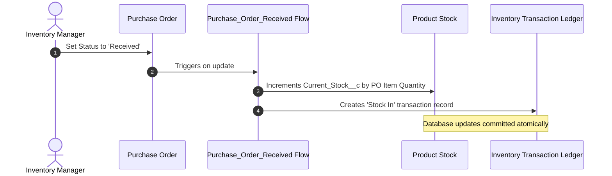
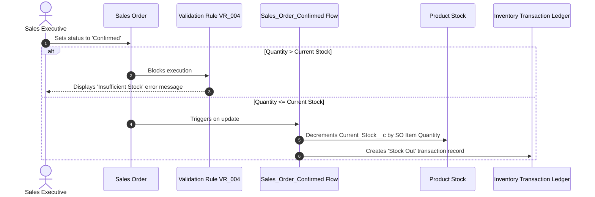
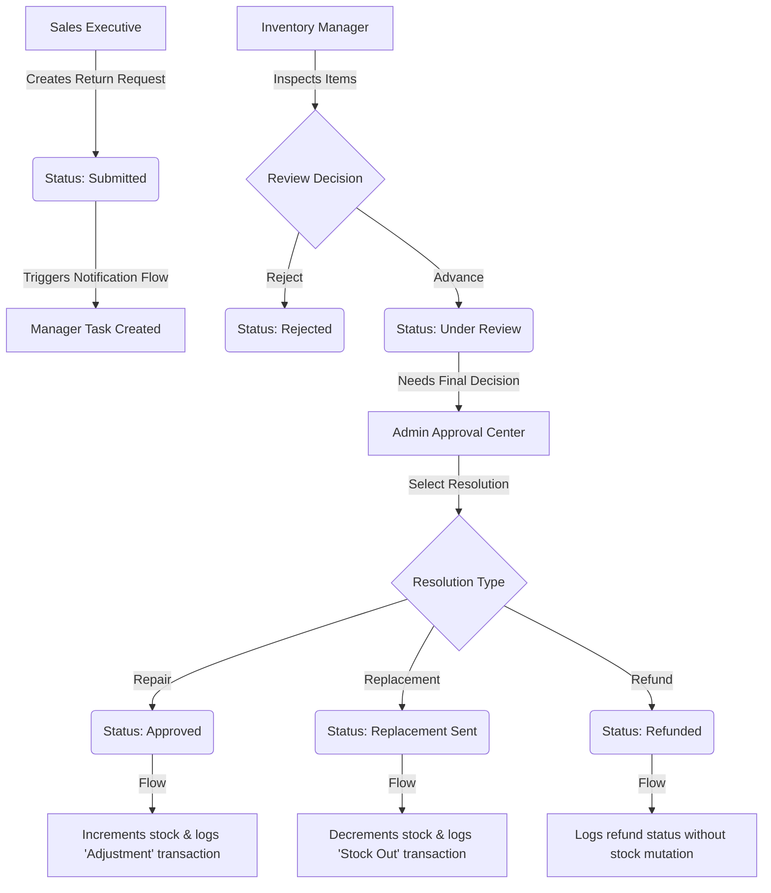

# Business Workflows & Automations

This document describes the three main business cycles managed by the Inventory Management System and how they map to automated Salesforce flows and database mutations.

---

## 1. Procurement Cycle (Stock In)

When stock is low, the Inventory Manager initiates replenishment from a supplier.

---

## 2. Sales Cycle (Stock Out)

Sales Executives capture customer purchases. The system protects stock from starvation using real-time validation checks.

---

## 3. Return & RMA Lifecycle

Tracks returned goods through initial submission, inspection, and final resolution.

