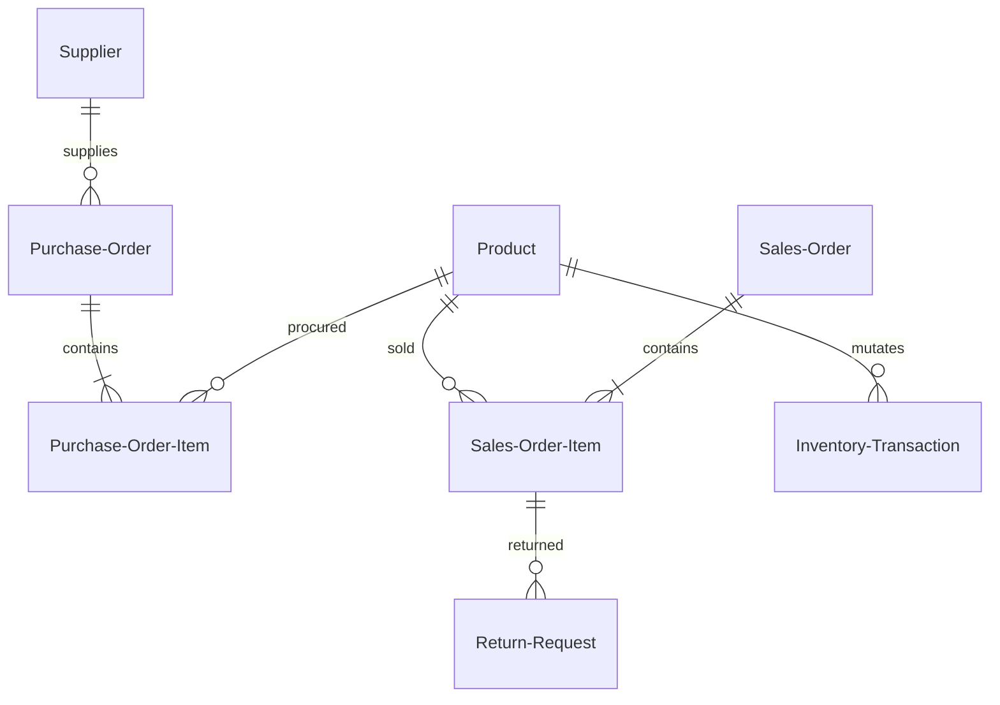

# Database Schema & Custom Objects

The Inventory Management System uses a set of custom objects that model the relational database structure of standard ERP inventory ledgers.

## Custom Objects & Key Fields

### 1. Product (`Product__c`)
Tracks inventory SKU, description, stock volumes, reorder thresholds, and status.
* **Product_Name__c** (Text, 255, Required)
* **SKU__c** (Text, 50, Unique, External ID, Required)
* **Current_Stock__c** (Number, 18, 0, Default: 0)
* **Minimum_Stock__c** (Number, 18, 0, Default: 5)
* **Price__c** (Currency, 16, 2, Required)
* **Cost__c** (Currency, 16, 2, Required) - Sensitive pricing cost rate.
* **Status__c** (Picklist: `Active`, `Draft`, `Discontinued`)

### 2. Supplier (`Supplier__c`)
Tracks third-party suppliers who fulfill procurement purchase orders.
* **Supplier_Name__c** (Text, 255, Required)
* **Email__c** (Email, Required)
* **Phone__c** (Phone)
* **Status__c** (Picklist: `Active`, `Inactive`)

### 3. Purchase Order (`Purchase_Order__c`)
Represents inbound restock requests sent to suppliers.
* **Name** (Auto-Number, Format: `PO-{0000}`)
* **Supplier__c** (Lookup to `Supplier__c`, Required)
* **Order_Date__c** (Date, Required)
* **Status__c** (Picklist: `Draft`, `Pending Approval`, `Approved`, `Received`, `Cancelled`)

### 4. Purchase Order Item (`Purchase_Order_Item__c`)
Line items matching products to their ordered quantity in a purchase order.
* **Purchase_Order__c** (Master-Detail to `Purchase_Order__c`, Required)
* **Product__c** (Lookup to `Product__c`, Required)
* **Quantity__c** (Number, 18, 0, Required)
* **Unit_Price__c** (Currency, 16, 2, Required)

### 5. Sales Order (`Sales_Order__c`)
Outbound customer orders created by Sales Executives.
* **Name** (Auto-Number, Format: `SO-{0000}`)
* **Customer_Name__c** (Text, 255, Required)
* **Customer_Email__c** (Email, Required)
* **Order_Date__c** (Date, Required)
* **Status__c** (Picklist: `Draft`, `Confirmed`, `Shipped`, `Cancelled`)

### 6. Sales Order Item (`Sales_Order_Item__c`)
Line items containing sales pricing and quantity details for products.
* **Sales_Order__c** (Master-Detail to `Sales_Order__c`, Required)
* **Product__c** (Lookup to `Product__c`, Required)
* **Quantity__c** (Number, 18, 0, Required)
* **Unit_Price__c** (Currency, 16, 2, Required)

### 7. Inventory Transaction (`Inventory_Transaction__c`)
The ledger auditing all changes to stock levels.
* **Name** (Auto-Number, Format: `ITX-{0000}`)
* **Product__c** (Lookup to `Product__c`, Required)
* **Transaction_Type__c** (Picklist: `Stock In`, `Stock Out`, `Adjustment`)
* **Quantity__c** (Number, 18, 0, Required)
* **Transaction_Date__c** (DateTime, Required)
* **Reference_Id__c** (Text, 100) - Records the originating SO or PO number.

### 8. Return Request (`Return_Request__c`)
Log of customer RMA request details, resolution types, and approval lifecycle.
* **Name** (Auto-Number, Format: `RMA-{0000}`)
* **Sales_Order_Item__c** (Lookup to `Sales_Order_Item__c`, Required)
* **Reason__c** (Text, Max, Required)
* **Resolution_Type__c** (Picklist: `Repair`, `Replacement`, `Refund`, Required)
* **Status__c** (Picklist: `Submitted`, `Under Review`, `Approved`, `Rejected`, `Replacement Sent`, `Refunded`, `Closed`)

---

## Entity Relationship Diagram (ERD)

