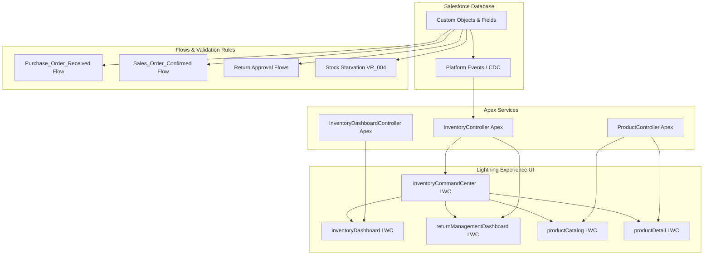

# System Architecture

This document describes the high-level architecture of the **Inventory Management System (IMS)**, explaining how custom components, low-code automations, and database layers integrate natively on the Salesforce platform.

## High-Level System Architecture

The system utilizes standard Salesforce Lightning Platform architectures. Lightning Web Components serve as the visual layout layer, executing Apex controller methods and binding custom Salesforce events to interact with custom objects. Automation flows react to database mutations to run background stock ledger updates.

## Architectural Design Principles

1. **Native Integration**: By building directly on Salesforce, the system inherits built-in security, user administration, reporting engines, standard database persistence, and transaction management.
2. **Event-Driven Auto-Refresh**: Utilizing Change Data Capture (CDC) platform events (`/data/Product__ChangeEvent`, etc.), the LWC dashboard subscribes to real-time events, automatically refreshing data metrics across user tabs without forcing full page reloads.
3. **Decoupled Business Logic**: Custom triggers and record-triggered flows handle record updates (e.g., updating product stock levels when a purchase order is received) asynchronously or during database transactions, separating user interface updates from structural database changes.
4. **Optimized Apex Controller Layer**: Heavy aggregates and queries are isolated inside cacheable and secured Apex classes (`WITH USER_MODE`), ensuring high performance and strong protection against unauthorized access.
