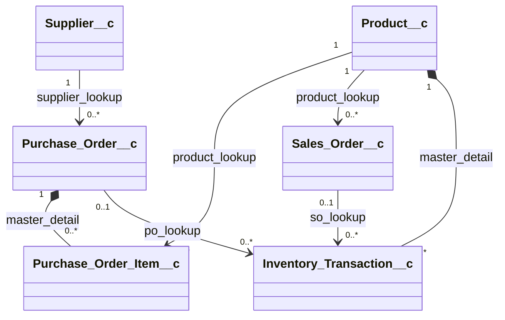

# Application Architecture - Inventory Management System

This document outlines the architectural details, database schema structure, user roles, data lifecycle, and process flow of the Inventory Management System on Salesforce.

---

## 1. Data Relationship & ERD Diagram
The database schema consists of six core objects:
- `Product__c` is the master catalog.
- `Supplier__c` is the registry of third-party vendors.
- `Purchase_Order__c` and its detail `Purchase_Order_Item__c` model procurement.
- `Sales_Order__c` models customer sales.
- `Inventory_Transaction__c` tracks history of stock movements.

---

## 2. Process Flow & Stock Lifecycle

### Procurement (Inflow)
1. Inventory Manager creates a `Purchase_Order__c` in `Draft` state.
2. Items are added via `Purchase_Order_Item__c`.
3. Order is marked as `Ordered`.
4. When delivery arrives, the PO is marked as `Received`.
5. A Record-Triggered Flow fires on transition to `Received`:
   * Loops through related `Purchase_Order_Item__c` records.
   * Increments `Product__c.Stock_On_Hand__c` by `Quantity_Ordered__c`.
   * Inserts an `Inventory_Transaction__c` record of type `Inflow` linking to the product and PO.

### Sales (Outflow)
1. Sales Executive creates a `Sales_Order__c` in `Draft` state.
2. The order is set to `Approved`.
3. When order is dispatched, it is set to `Shipped`.
4. A Record-Triggered Flow fires on transition to `Shipped`:
   * Checks if `Product__c.Stock_On_Hand__c` >= `Sales_Order__c.Quantity_Ordered__c`.
   * If yes:
     * Decrements `Product__c.Stock_On_Hand__c` by `Quantity_Ordered__c`.
     * Inserts an `Inventory_Transaction__c` of type `Outflow` linking to the product and SO.
   * If no:
     * Prevents shipment or logs an error.
